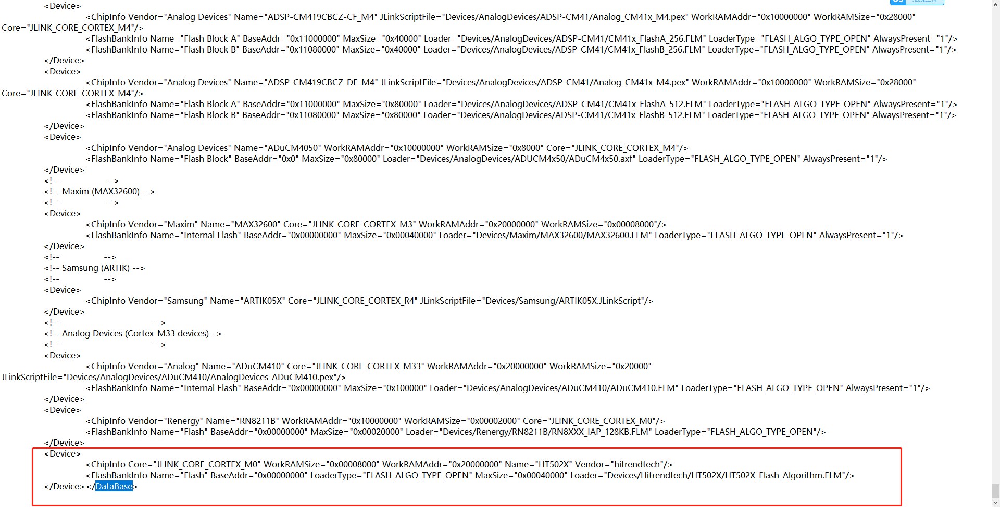
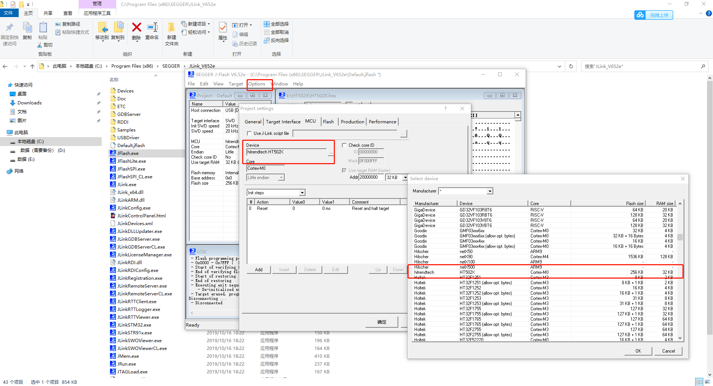
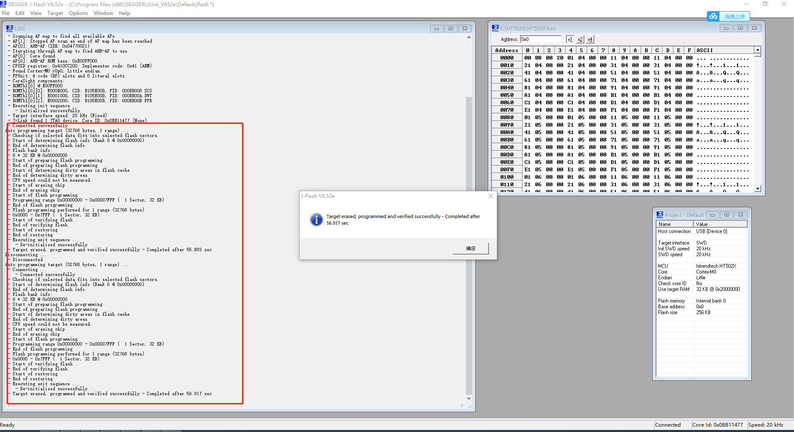
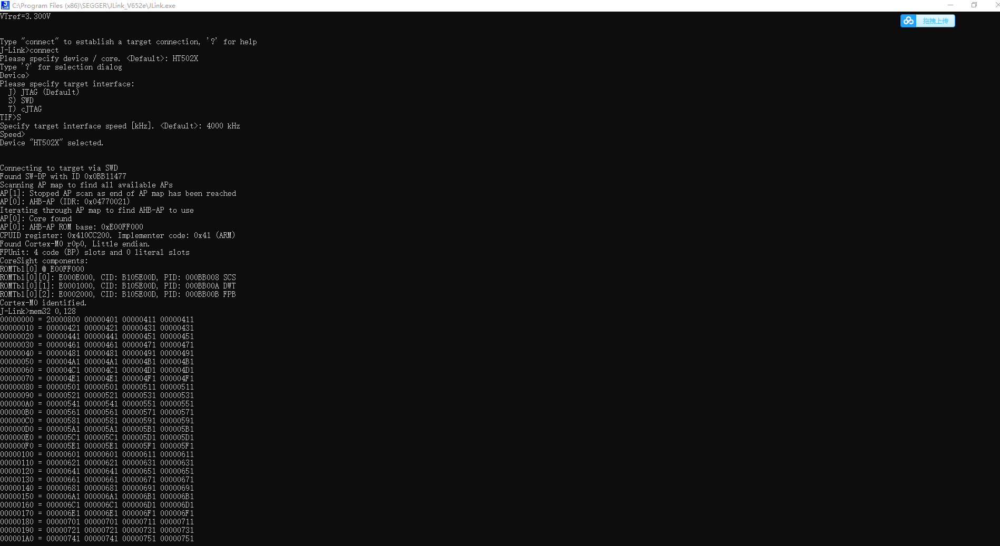

# 说明

这是一个用于HT5027的Flash编程算法。

# 注意事项

- 由于看门狗问题,此编程算法必须在TEST=0且JTAGWDTEN （PA6）=0时使用。
- 由于HT5027比较坑的Flash读保护机制,若编程后Flash的0xFC1地址不为0xFF，将有可能校验失败。
- 由于支持不完善,故推荐每次写入前都是用芯片擦除而不是扇区擦除。

# 测试方法

采用Jlink自带的Jflash工具测试。

## 注意事项

- 必须是从Segger官网下载的新版Jlink软件,旧版Jlink可能不支持。测试版本为V652e。
- 所有操作均在Jlink安装目录下进行。

## 测试步骤

### 添加支持

编辑JLinkDevices.xml，在xml节点Database结束前添加以下内容以下对HT502X的支持。

```xml
<Device>
		<ChipInfo Core="JLINK_CORE_CORTEX_M0" WorkRAMSize="0x00008000" WorkRAMAddr="0x20000000" Name="HT502X" Vendor="hitrendtech"/>
		<FlashBankInfo Name="Flash" BaseAddr="0x00000000" LoaderType="FLASH_ALGO_TYPE_OPEN" MaxSize="0x00040000" Loader="Devices/Hitrendtech/HT502X/HT502X_Flash_Algorithm.FLM"/>
</Device>
```



将本工程下的HT502X_Flash_Algorithm.FLM复制到Jlink安装目录下的Devices/Hitrendtech/HT502X/HT502X_Flash_Algorithm.FLM。

### 硬件准备

- 将TEST引脚和PA6接地。
- 连接好Jlink。

### 烧写测试

打开Jflash,准备一个测试用的Hex并打开,注意0xFC1必须是0xFF。

选择HT502X。



按F7开始烧录。



### 验证

使用Jlink的mem32命令可读取写入的内容。


